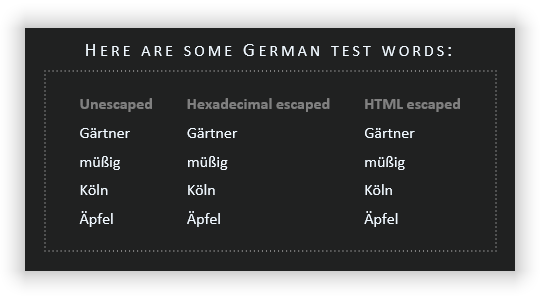
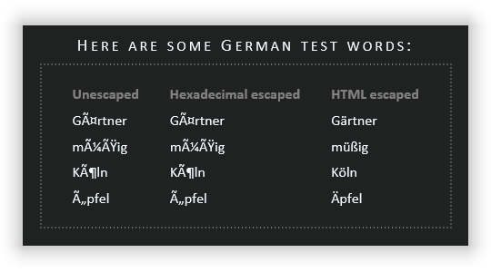

# Encoding issue
This repository illustrates an encoding issue that occurs when WebPack compiles TypeScript files in **production** mode.

# Steps to reproduce

First, install all NPM packages using `npm install`.

## (1) create **development** code ...
1. Run script `webpack:dev`.

   It will compile the user control "`test-uc`" in **development** mode.
1. Go to your hard drive and open "`./html/test.html`" in your preferred web browser.
2. You will notice that all German words are displayed as expected:

   

## (2) create **production** code ...
1. Run script `webpack:dev`.

   It will compile the user control "`test-uc`" in **production** mode.
1. Go to your hard drive and open "`./html/test.html`" in your preferred web browser.
2. You will notice that all German words are displayed erroneous:

   